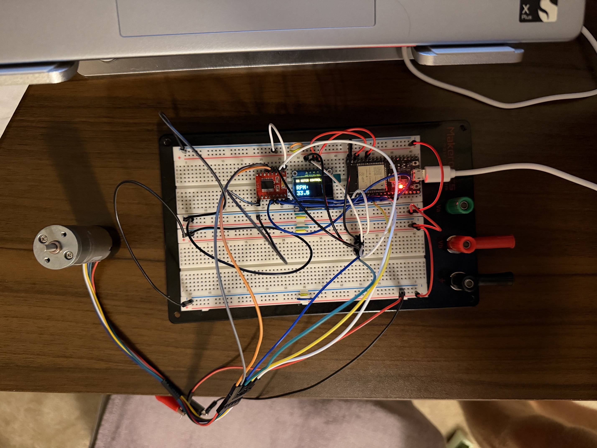
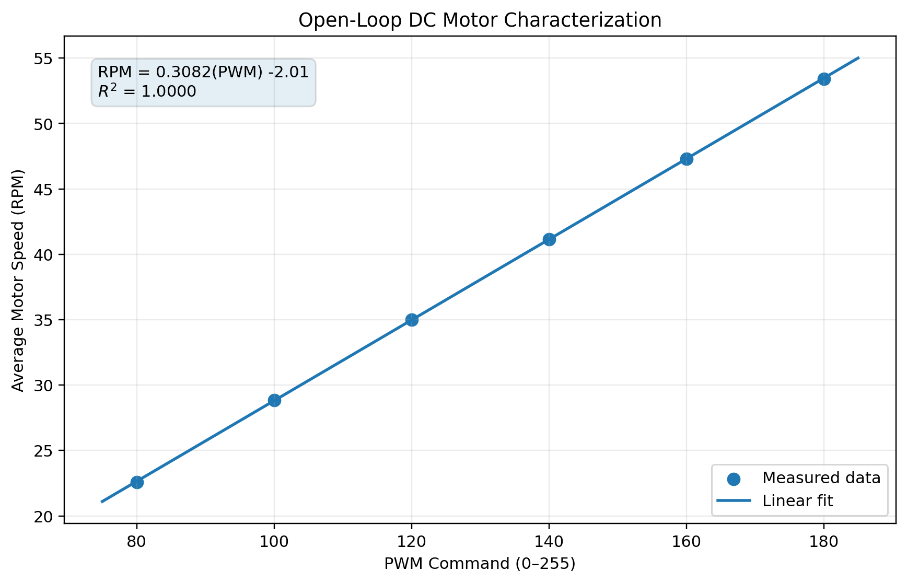
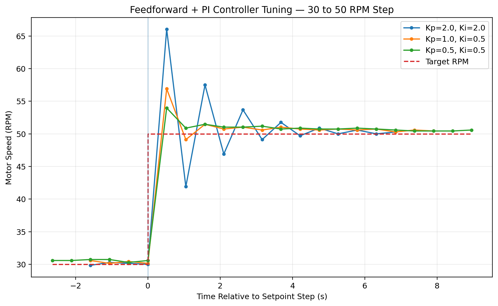
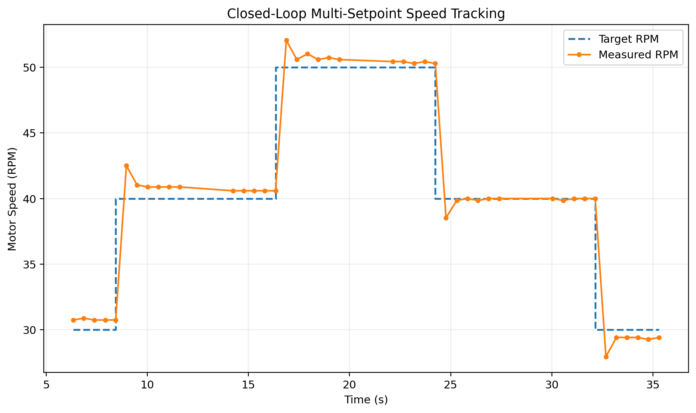

# ESP32 Closed-Loop DC Motor Speed Controller

An embedded closed-loop DC motor speed control system built around an ESP32 microcontroller. The system uses Hall-effect encoder feedback, feedforward control, and PI feedback control to regulate motor speed under changing setpoints and external disturbances.

The project was developed from the ground up, beginning with individual hardware validation and progressing through motor characterization, controller design, tuning, and experimental testing.

**Technologies:** ESP32 · Embedded C/C++ · PI Control · Feedforward Control · PWM · Quadrature Encoder · TB6612FNG · I²C · OLED · Experimental Data Analysis

## Final Hardware Setup

The completed breadboard prototype integrates the ESP32, TB6612FNG motor driver, encoder-equipped DC gearmotor, potentiometer setpoint control, and OLED telemetry into a standalone closed-loop speed control system.

## Key Features

- Closed-loop DC motor speed regulation using an ESP32
- Hall-effect quadrature encoder for real-time speed feedback
- Feedforward control based on experimental PWM-to-RPM motor characterization
- PI feedback controller for steady-state error correction and disturbance rejection
- Adjustable RPM setpoint using a potentiometer
- OLED display for real-time system information
- Serial telemetry for controller analysis and data collection
- Experimental controller tuning and step-response testing
- Multi-setpoint tracking validation

## System Overview

The controller regulates the speed of a DC motor by continuously measuring its actual RPM and comparing it with a desired setpoint.

The control loop operates as follows:

1. The user selects a desired motor speed using a potentiometer.
2. The ESP32 reads pulses from the motor's Hall-effect encoder.
3. Encoder counts are converted into measured motor RPM.
4. A feedforward model estimates the PWM command required to achieve the requested speed.
5. The PI controller calculates a correction based on the difference between the target and measured RPM.
6. The feedforward and PI outputs are combined to generate the final PWM command.
7. The motor driver applies the PWM signal to the DC motor.
8. Motor speed is continuously measured and fed back into the controller.

This allows the system to maintain the commanded speed even when the motor experiences disturbances or changes in load.

## Control Strategy

The final controller combines **feedforward control** with **PI feedback control**.

### Feedforward Control

The motor was experimentally characterized by measuring steady-state RPM at several PWM values. This data was used to develop an approximate relationship between PWM command and motor speed.

The feedforward controller uses this model to predict the PWM value required for a requested RPM before feedback correction is applied.

### PI Feedback Control

The PI controller corrects errors between the requested and measured motor speeds.

- **Proportional control** responds immediately to RPM error.
- **Integral control** accumulates error over time to reduce steady-state error.

The final motor command is the combination of the feedforward prediction and PI correction.

This approach provides faster setpoint response than relying on feedback alone while still allowing the controller to compensate for disturbances and modeling error.

## Experimental Results

The controller was developed and validated experimentally rather than relying solely on theoretical motor parameters. Testing was performed to characterize the motor, tune the feedback controller, and evaluate closed-loop setpoint tracking.

### PWM-to-RPM Characterization

The motor was first operated open-loop at several PWM commands to determine the relationship between PWM input and steady-state motor speed. The resulting data was used to develop the feedforward portion of the controller.

The measured relationship between PWM and RPM provides the controller with an estimate of the PWM command required for a given speed setpoint.

### PI Controller Tuning

The proportional and integral gains were experimentally adjusted while observing the motor's response. Controller performance was evaluated based on tracking error, transient response, and steady-state behavior.

The final tuning was selected to provide a balance between responsive error correction and stable motor operation.

### Multi-Setpoint Tracking

The completed controller was tested across multiple commanded speeds to evaluate its ability to follow changing RPM setpoints.

During setpoint changes, the feedforward model immediately adjusts the nominal PWM command while the PI controller corrects the remaining tracking error. The system settles near each commanded speed with relatively small steady-state error.

## Hardware

The system was built around the following components:

- ESP32 development board
- TB6612FNG dual H-bridge motor driver
- 12 V DC geared motor with dual-channel Hall-effect encoder
- SSD1306 I²C OLED display
- 10 kΩ linear potentiometer
- Breadboard and jumper wiring
- External bench power supply for motor power

The ESP32 handles motor control, encoder measurement, setpoint input, OLED communication, and closed-loop control logic.

The TB6612FNG provides the power stage between the ESP32's low-voltage control signals and the DC motor. The motor's Hall-effect encoder provides quadrature feedback used to calculate output-shaft speed.

## Repository Structure

The repository contains the final controller firmware along with the test programs and experimental data used throughout development.

- [`Code/Final_System/`](Code/Final_System/) — Final integrated closed-loop motor controller
- [`Code/PI_Controller/`](Code/PI_Controller/) — Feedforward/PI development, tuning, and controller test programs
- [`Code/Motor_Test/`](Code/Motor_Test/) — Initial motor and driver validation
- [`Code/OLED_Test/`](Code/OLED_Test/) — OLED and I²C hardware testing
- [`Testing/`](Testing/) — Experimental data, plots, controller tuning, and setpoint-tracking results
- [`Notes/Daily_Log.md`](Notes/Daily_Log.md) — Development notes and troubleshooting history

### Final Firmware

The completed integrated controller can be found here:

[`Final_Working_Board.ino`](Code/Final_System/Final_Working_Board/Final_Working_Board.ino)

## Development and Troubleshooting

The system was developed incrementally, with each subsystem tested independently before integration into the final controller.

### Hardware Bring-Up

Initial development focused on validating the OLED display, motor driver, and Hall-effect encoder individually before combining them into the complete system.

Several hardware issues were identified during development:

- Diagnosed an I²C/OLED communication issue during initial display testing and verified operation after replacing the display module.
- Identified a failed TB6612FNG motor driver after measuring an abnormal low-resistance path between VM and GND. Replacing the driver restored normal motor operation.
- Experimentally determined the motor encoder resolution to be approximately **816 counts per output-shaft revolution**.
- Used bench power-supply voltage/current limiting and multimeter measurements to troubleshoot power-delivery and wiring issues.

### Controller Development

Control-system development progressed through several stages:

1. Verified open-loop motor operation using PWM.
2. Implemented encoder-based RPM measurement.
3. Implemented proportional feedback control.
4. Added integral action to reduce steady-state tracking error.
5. Experimentally characterized the relationship between PWM command and motor RPM.
6. Developed a feedforward model from the measured motor data.
7. Combined feedforward and PI feedback control.
8. Experimentally tuned controller gains using step-response testing.
9. Validated operation across multiple RPM setpoints.
10. Added potentiometer-based setpoint control and OLED telemetry for standalone operation.

This incremental approach allowed hardware, measurement, and control issues to be isolated before they were incorporated into the complete system.

## Disturbance Rejection

The completed controller was also tested under an externally applied mechanical load.

While the motor was operating near a constant 40 RPM setpoint, resistance was manually applied to the output shaft. The resulting decrease in measured RPM produced a positive control error, causing the PI controller to increase the PWM command. After the disturbance was removed, the controller reduced the PWM command and returned the motor toward the requested speed.

This test demonstrated the primary advantage of closed-loop control over a fixed open-loop PWM command: the controller can automatically respond to changes in motor loading.

## Future Improvements

The current system successfully demonstrates closed-loop motor speed control, but several improvements could further expand the project:

- Design a custom PCB to replace the breadboard-based prototype.
- Add current sensing to monitor motor load and electrical behavior.
- Implement overcurrent and fault protection.
- Compare PI control performance with a full PID controller.
- Improve encoder processing using full quadrature decoding.
- Add additional automated data logging and performance metrics.
- Develop a more permanent mechanical enclosure and user interface.

## Project Outcome

This project resulted in a functional embedded closed-loop DC motor speed controller capable of tracking adjustable speed commands and responding to changes in motor load.

The project provided hands-on experience with:

- Embedded C/C++ programming on the ESP32
- PWM motor control and H-bridge operation
- Hall-effect encoder feedback and RPM measurement
- Experimental system characterization
- Feedforward and PI control
- Controller tuning and step-response analysis
- Hardware troubleshooting using a multimeter and bench power supply
- Serial data collection and experimental validation
- I²C communication and OLED telemetry

Rather than treating the motor and controller as ideal components, the system was developed through experimental measurement, iterative testing, and hardware troubleshooting.

